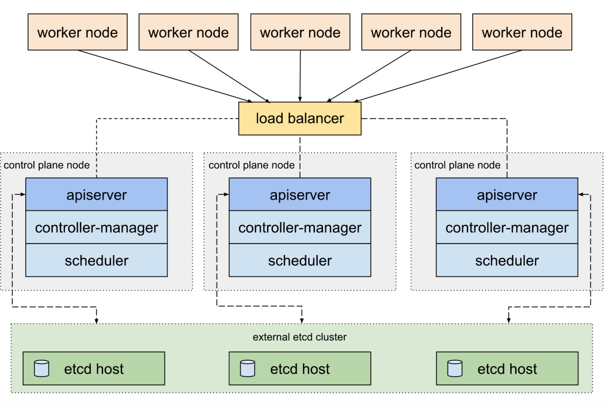

  
                                **figure contrainer deployment**   

                                **figure k8s master and node**     
# k8s-shell
k8s install scripts . Include pvc , configmap , mysql , redis , elk , etc .
### prepare
*check network and productive  ,on master and node*  
```
ip link
cat /sys/class/dmi/id/product_uuid
```
*set host name*  
master name：  k8smaster   
node name：    k8snode-（ip）   
for example :   
```
hostnamectl set-hostname  k8snode-112  
hostnamectl set-hostname  k8snode-22  
hostnamectl set-hostname  k8smaster  
```
*set domain name*  
vi /etc/hosts  
```
172.22.22.11  k8snode-11
172.22.22.13  k8snode-13
172.22.22.10  k8smaster mirrors.cloud.com
```
*close swap,temp close and persistent close*  
```
 swapoff -a
```
vi  /etc/fstab  
```
#/dev/mapper/centos-swap swap                    swap    defaults        0 0
```
*close firewall*  
```
systemctl stop firewalld
systemctl disable firewalld
```
### install docker  
```
yum install  -y yum-utils device-mapper-persistent-data lvm2
yum-config-manager --add-repo https://download.docker.com/linux/centos/docker-ce.repo
yum update  -y
yum install  docker-ce-18.06.2.ce -y
mkdir /etc/docker
```
*config docker*  
```
mkdir -p /home/datacenter/docker-data
cat > /etc/docker/daemon.json <<EOF
{
  "exec-opts":["native.cgroupdriver=systemd"],
  "log-driver": "json-file",
  "log-opts": {
    "max-size": "100m"
  },
  "storage-driver": "overlay2",
  "graph":"/home/datacenter/docker-data",
  "storage-opts":[
    "overlay2.override_kernel_check=true"
  ]
}
EOF
```
*set docker service*  
```
mkdir -p /etc/systemd/system/docker.service.d
systemctl daemon-reload
systemctl enable docker.service
systemctl restart docker
```
*check  docker info*  
```
docker info
```
### Installing kubeadm,kubelet and kubectl on all of your machines  
if you have a netwrok  problem, please on all the machines exectue the flowing shell .  
```
docker pull mirrorgooglecontainers/kube-apiserver:v1.14.2
docker pull mirrorgooglecontainers/kube-controller-manager:v1.14.2
docker pull mirrorgooglecontainers/kube-scheduler:v1.14.2
docker pull mirrorgooglecontainers/kube-proxy:v1.14.2
docker pull mirrorgooglecontainers/pause:3.1
docker pull mirrorgooglecontainers/etcd:3.3.10
docker pull coredns/coredns:1.3.1

docker tag mirrorgooglecontainers/kube-apiserver:v1.14.2 k8s.gcr.io/kube-apiserver:v1.14.2
docker tag mirrorgooglecontainers/kube-controller-manager:v1.14.2 k8s.gcr.io/kube-controller-manager:v1.14.2
docker tag mirrorgooglecontainers/kube-scheduler:v1.14.2 k8s.gcr.io/kube-scheduler:v1.14.2
docker tag mirrorgooglecontainers/kube-proxy:v1.14.2 k8s.gcr.io/kube-proxy:v1.14.2
docker tag mirrorgooglecontainers/pause:3.1 k8s.gcr.io/pause:3.1
docker tag mirrorgooglecontainers/etcd:3.3.10 k8s.gcr.io/etcd:3.3.10
docker tag coredns/coredns:1.3.1 k8s.gcr.io/coredns:1.3.1

docker rmi mirrorgooglecontainers/kube-apiserver:v1.14.2
docker rmi mirrorgooglecontainers/kube-controller-manager:v1.14.2
docker rmi mirrorgooglecontainers/kube-scheduler:v1.14.2
docker rmi mirrorgooglecontainers/kube-proxy:v1.14.2
docker rmi mirrorgooglecontainers/pause:3.1
docker rmi mirrorgooglecontainers/etcd:3.3.10
docker rmi coredns/coredns:1.3.1

docker images
```
*set install source ,mirrors of aliyun*
```
cat <<EOF > /etc/yum.repos.d/kubernetes.repo
[kubernetes]
name=Kubernetes
baseurl=https://mirrors.aliyun.com/kubernetes/yum/repos/kubernetes-el7-x86_64
enabled=1
gpgcheck=0
repo_gpgcheck=0
gpgkey=https://mirrors.aliyun.com/yum/doc/yum-key.gpg https://mirrors.aliyun.com/yum/doc/rpm-package-key.gpg
exclude=kube*
EOF
```
*Set SELinux in permissive mode (effectively disabling it)*
```
setenforce 0
sed -i 's/^SELINUX=enforcing$/SELINUX=permissive/' /etc/selinux/config
#yum install -y kubelet kubeadm kubectl --disableexcludes=kubernetes
yum install -y kubelet-1.14.2 kubeadm-1.14.2 kubectl-1.14.2  --disableexcludes=kubernetes
yum list kubelet kubeadm kubectl  --showduplicates|sort -r

systemctl enable --now kubelet
systemctl enable kubelet.service
```
*ensure net.bridge.bridge-nf-call-iptables is set to 1 in your sysctl config*
```
cat <<EOF >  /etc/sysctl.d/k8s.conf
net.bridge.bridge-nf-call-ip6tables = 1
net.bridge.bridge-nf-call-iptables = 1
EOF
sysctl --system
```
*Make sure that the br_netfilter module is loaded before this step*
```
modprobe br_netfilter
lsmod | grep br_netfilter
```
*only on master machines  ,install  Calico network*
```
kubectl apply -f https://docs.projectcalico.org/v3.3/getting-started/kubernetes/installation/hosted/rbac-kdd.yaml
kubectl apply -f https://docs.projectcalico.org/v3.3/getting-started/kubernetes/installation/hosted/kubernetes-datastore/calico-networking/1.7/calico.yaml
kubeadm init --pod-network-cidr=192.168.0.0/16
```
*for  root user ,set kubeadm config*  
vi ~/.bashrc
```
export KUBECONFIG=/etc/kubernetes/admin.conf
source  ~/.bashrc
kubectl get pod --all-namespaces -o wide
kubectl get nodes
```
*see log and pod status*  
```
kubectl describe pod kube-proxy-wr8np -n kube-system
journalctl -f -u kubelet.service
```

### only on node , join the master  
```
kubeadm join 172.16.10.139:6443 --token lovodp.mpxnamtzfnqd58il \
    --discovery-token-ca-cert-hash sha256:e765f345f34f63ef6f74ee782cbf729515197fb32e3e93e9d6f6c72ad4cf5297
```

### install k8s dashboard  .only on master machines  
```
docker pull mirrorgooglecontainers/kubernetes-dashboard-amd64:v1.10.1
docker tag mirrorgooglecontainers/kubernetes-dashboard-amd64:v1.10.1  k8s.gcr.io/kubernetes-dashboard-amd64:v1.10.1
docker  rmi mirrorgooglecontainers/kubernetes-dashboard-amd64:v1.10.1
cd /usr/local/src
wget https://raw.githubusercontent.com/kubernetes/dashboard/v1.10.1/src/deploy/alternative/kubernetes-dashboard.yaml
 ```
vi  kubernetes-dashboard.yaml  
```
spec:
      containers:
      - name: kubernetes-dashboard
      - --enable-skip-login


spec:
  type: NodePort

  ports:
    - port: 300001
```

*create rbca role and user*    
vi  dashboard-admin.yaml  
```
apiVersion: rbac.authorization.k8s.io/v1beta1
kind: ClusterRoleBinding
metadata:
 name: kubernetes-dashboard
 labels:
   k8s-app: kubernetes-dashboard
roleRef:
 apiGroup: rbac.authorization.k8s.io
 kind: ClusterRole
 name: cluster-admin
subjects:
- kind: ServiceAccount
 name: kubernetes-dashboard
 namespace: kube-system
```

*create dashboard application*  
```
kubectl create -f kubernetes-dashboard.yaml
kubectl apply -f dashboard-admin.yaml
```

### install  Gitlab 、 Runner、Docker Mirrors .only on master machines  
*install docker registry*  
```
mkdir -p /home/datacenter/registry
docker run -d -p 172.16.10.71:5000:5000 --restart=always --name registry -v /home/datacenter/registry:/var/lib/registry  registry:latest
curl -XGET http://mirrors.cloud.com:5000/v2/_catalog
```
*install Gitlab and Runner*    
```
docker pull gitlab/gitlab-ce:latest
mkdir -vp /home/datacenter/gitlab/{data,logs,config}
docker run --detach --hostname 172.16.10.71 --publish 172.16.10.71:443:443 --publish 172.16.10.71:80:80 --publish 172.16.10.71:1022:22 --name gitlab --restart always --volume /home/datacenter/gitlab/config:/etc/gitlab --volume /home/datacenter/gitlab/logs:/var/log/gitlab --volume /home/datacenter/gitlab/data:/var/opt/gitlab gitlab/gitlab-ce:latest
dokcer stop gitlab
dokcer start gitlab
```
*install gitlab runner*  
```
docker run -d --name gitlab-runner --restart always \
   -v /srv/gitlab-runner/config:/etc/gitlab-runner \
   -v /var/run/docker.sock:/var/run/docker.sock \
   gitlab/gitlab-runner:latest
```
*registry gitlab runner of maven  to gitlab server by token*   
```
docker run --rm -v /srv/gitlab-runner/config:/etc/gitlab-runner gitlab/gitlab-runner register  --non-interactive  --executor "docker"  --docker-image "mirrors.cloud.com:5000/cloudframework/maven-jdk8-docker:3.5.4"    --url "http://172.16.10.71/" --registration-token "uszNQNqTnGqHmJgzZysV" --description "springcloud" --tag-list "springcloud" --run-untagged="true" --locked="false"
```
*set gitlab runner config*  
vi /srv/gitlab-runner/config/config.toml  
```
volumes =["/var/run/docker.sock:/var/run/docker.sock","/cache","/root/.m2:/root/.m2"]
pull_policy = "if-not-present"
```
registry gitlab runner of npm  to gitlab server by token  
```
docker run --rm -v /srv/gitlab-runner/config:/etc/gitlab-runner gitlab/gitlab-runner register  --non-interactive  --executor "docker"  --docker-image "mirrors.cloud.com:5000/alpine-node-docker-vue:latest"    --url "http://172.16.10.71/" --registration-token "9yrChyhphp9tWUBJftVK" --descriptio "vue" --tag-list "vue" --run-untagged="true" --locked="false"
```
*set gitlab runner config*  
vi /srv/gitlab-runner/config/config.toml  
```
    volumes =["/var/run/docker.sock:/var/run/docker.sock","/cache","/root/.npm:/root/.npm"]
    pull_policy = "if-not-present"
```
###  make tools docker ,npm /maven/kubectl ,and publish to docker registry  
*make  npm vue  docker*  
```
FROM  node:10.16.0-alpine
MAINTAINER  Tony dong <dongshaofeng@189.cn>
RUN npm install -g @vue/cli;\
   apk add --no-cache \
        ca-certificates \
        curl \
        openssl
RUN set -x;\
    curl -fSL "https://download.docker.com/linux/static/stable/x86_64/docker-18.06.2-ce.tgz" -o docker.tgz;\
    tar -xzvf docker.tgz;\
    mv docker/* /usr/local/bin/;\
    rmdir docker;\
    rm docker.tgz;\
    docker -v
```
*build and publish npm docker to docker  Registry*    
```
docker build -t mirrors.cloud.com:5000/alpine-node-docker-vue:latest  .
docker push mirrors.cloud.com:5000/alpine-node-docker-vue:latest
```
*config docker*    
vi  daemon.json  
```
{
  "insecure-registries" :["172.16.10.71:5000"]
}
```
*make  maven  vue  docker*    
vi  Dockerfile  
```
FROM maven:3.5.4-jdk-8-alpine
MAINTAINER  Tony dong <dongshaofeng@189.cn>
COPY settings.xml /usr/share/maven/ref/
RUN apk add --no-cache \
        ca-certificates \
        curl \
        openssl
RUN set -x;\
    curl -fSL "https://download.docker.com/linux/static/stable/x86_64/docker-18.06.2-ce.tgz" -o docker.tgz;\
    tar -xzvf docker.tgz;\
    mv docker/* /usr/local/bin/;\
    rmdir docker;\
    rm docker.tgz;\
    docker -v
```
vi settings.xml  
```
<settings xmlns="http://maven.apache.org/SETTINGS/1.0.0"
  xmlns:xsi="http://www.w3.org/2001/XMLSchema-instance"
  xsi:schemaLocation="http://maven.apache.org/SETTINGS/1.0.0
                      https://maven.apache.org/xsd/settings-1.0.0.xsd">
  <localRepository>/usr/share/maven/ref/repository</localRepository>
  <mirrors>
    <mirror>
        <!--This sends everything else to /public -->
        <id>aliyun-nexus</id>
        <mirrorOf>*</mirrorOf>
        <url>http://maven.aliyun.com/nexus/content/groups/public/</url>
    </mirror>
    <mirror>
        <!--This is used to direct the public snapshots repo in the
            profile below over to a different nexus group -->
        <id>aliyun-nexus-public-snapshots</id>
        <mirrorOf>public-snapshots</mirrorOf>
        <url>http://maven.aliyun.com/nexus/content/repositories/snapshots/</url>
      </mirror>
    </mirrors>
</settings>
```
*build and publish maven docker to docker  Registry*    
```
docker build -t mirrors.cloud.com:5000/cloudframework/maven-jdk8-docker:3.5.4 .
docker push mirrors.cloud.com:5000/cloudframework/maven-jdk8-docker:3.5.4
```
*make java runtime docker*    
```
docker pull fancybing/java:serverjre-8
docker  tag  fancybing/java:serverjre-8  cloudframework/jdk:1.8
```
*make kubectl docker*  
```
docker pull lachlanevenson/k8s-kubectl:v1.14.2
cd /usr/local/src
mkdir -p /usr/local/src/kubectldocker
cd /usr/local/src/kubectldocker
scp k8smaster:/etc/kubernetes/admin.conf /usr/local/src/kubectldocker/admin.conf
```
vi Dockerfile  
```
FROM lachlanevenson/k8s-kubectl:v1.14.1
LABEL maintainer="Tony <dongshaofeng@189.cn>"
ENV KUBE_LATEST_VERSION="v1.14.1"
ADD admin.conf /root/.kube/config
WORKDIR /root
```
*build and publish kubectl docker to docker  Registry*    
```
docker build -t mirrors.cloud.com:5000/kubectl:1.14.2 .
docker push mirrors.cloud.com:5000/kubectl:1.14.2
```
### install redis
```
docker pull mirrorgooglecontainers/redis:e2e
docker tag mirrorgooglecontainers/redis:e2e k8s.gcr.io/redis:e2e
docker pull mirrorgooglecontainers/google_samples/gb-redisslave:v3
docker tag mirrorgooglecontainers/google_samples/gb-redisslave:v3 gcr.io/google_samples/gb-redisslave:v3
kubectl apply -f https://k8s.io/examples/application/guestbook/redis-master-deployment.yaml
kubectl apply -f https://k8s.io/examples/application/guestbook/redis-master-service.yaml
kubectl apply -f https://k8s.io/examples/application/guestbook/redis-slave-deployment.yaml
kubectl apply -f https://k8s.io/examples/application/guestbook/redis-slave-service.yaml
kubect exec -it redis-master bash
```

### how to make master as node
```
kubectl taint nodes --all node-role.kubernetes.io/master-1
```
### how to disable master as node
```
kubectl taint nodes k8s node-role.kubernetes.io/master=true:NoSchedule
```
### how to get new token
```
kubeadm token create
```
### how to delete node,on master
```
kubectl drain k8s-node1 --delete-local-data --force --ignore-daemonsets
kubectl delete node k8s-node1
kubeadm reset
```
